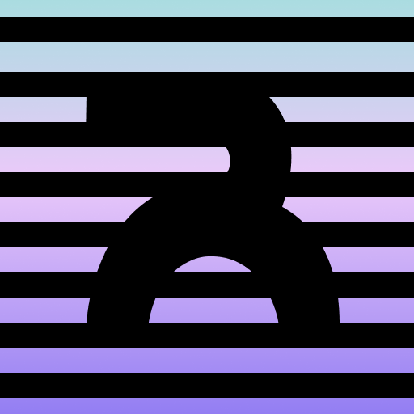

<table style="width: 100%; border: none;" cellspacing="0" cellpadding="0" border="0">
  <tr>
    <td></td>
    <td rowspan="3"><h3>Rewave</h3></td>
  </tr>
  <tr>
    <td></td>
  </tr>
  <tr>
    <td></td>
  </tr>
</table>

<!--
| ⚠️        Still in the early stages of development. Not yet ready for production  |
|-----------------------------------------|
-->

> **Warning**: Still in the early stages of development. **Not yet ready** for production

Socket-based, response-request style binary protocol handles communication between the client and **repelDB** instance through a regular TCP connection.

## Rewave Protocol
Rewave uses binary format JSON object. 

## Rewave Request Format
Each request has a specific format

## Features
* [x] Request-response style API
* [x] Asynchronous TCP listener

## Planned
* [ ] User authentication
* [ ] TLS support
* [ ] Distributed server

<!--
## Release Changes
> **Note** : A stable v1.0 release will not happen until all major bugs were fixed.
-->

## License
Rewave is license under [GPL v3 (GNU General Public License)](../LICENSE)
